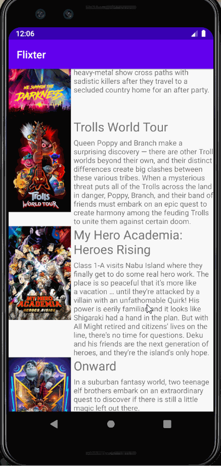
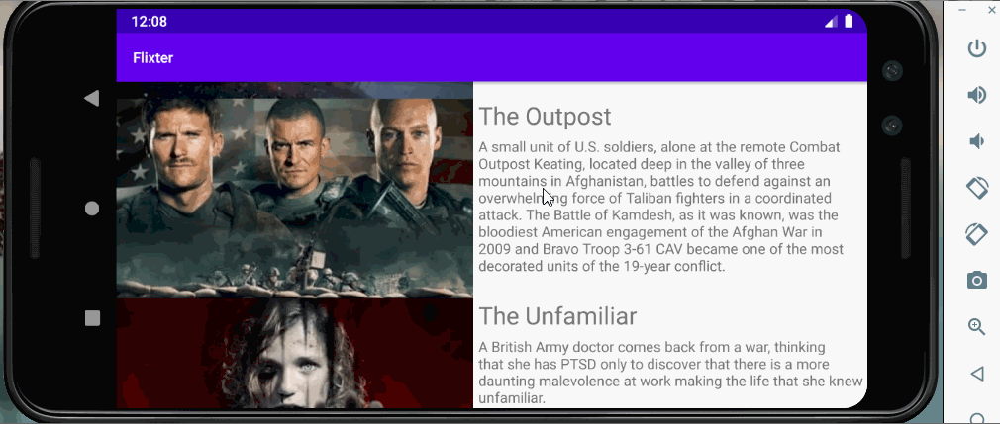

# Flix
Flix is an app that allows users to browse movies from the [The Movie Database API](http://docs.themoviedb.apiary.io/#).

Submitted By: **Swanora Campbell**

## Flix Part 2

### User Stories

#### REQUIRED (10pts)

- [X] (8pts) Expose details of movie (ratings using RatingBar, popularity, and synopsis) in a separate activity.
- [X] (2pts) Allow video posts to be played in full-screen using the YouTubePlayerView.

#### BONUS

- [X] Implement a shared element transition when user clicks into the details of a movie (1 point).
- [X] Trailers for popular movies are played automatically when the movie is selected (1 point).
  - [X] Youtube continues to play from current timestamp instead of the beginning whenever in fullscreen or the orientation changes.
  - [X] When clicking on a popular movie (i.e. a movie voted for more than 5 stars) the video should be played immediately.
  - [X] Less popular videos rely on the detailed page should show an image preview that can initiate playing a YouTube video.
- [X] Add a play icon overlay to popular movies to indicate that the movie can be played (1 point).
- [X] Apply data binding for views to help reduce view boilerplate. (1 point)
- [X] Add a rounded corners for the images using the Glide transformations. (1 point)
- [X] Added Rated R checkbox and Released Date to Detailed View
- [X] Added an app icon instead of android's default

### App Walkthough GIF

  
GIF created with [LiceCap](http://www.cockos.com/licecap/).

### Notes

- Laptop did not have VT-x enabled in the BIOS and I was unable to get the AVD working. After enabling VT-x in the BIOS and adding YoutubePlayer to the DetailActivity the app kept crashing on both a virtual device and a physical device). I had to delete everything, including AVDs and restart from where flix Part 1 left off. Installing a new AVD, updating a SDK tool and restarting android studio worked and development was smooth henceforth.
- Data Bindig is a bit confusing, there were so many different ways to bind the views. I'm not sure I did that correctly but will update as I continue to learn and grasp the concept better
- I forgot that images needed to be loaded through glide/picasso and when I implemented the play icon and spent hours wondering why I could not see it, lol. 
- Took me forever to implement playback for Youtube so that it continued to play from it's current timestamp whenever the screen orientation changed, instead of starting at the beginning
- Tried implementing a shadow effect, failed miserably lol
- Also failed to implement a loading icon. I did but removed it because it was not to my liking.
- I've learned that I do not have an eye for design 😂. I tried but the app still isn't appealing 🤷‍♀️

## Open-source libraries used
- [Android Async HTTP](https://github.com/codepath/CPAsyncHttpClient) - Simple asynchronous HTTP requests with JSON parsing
- [Glide](https://github.com/bumptech/glide) - Image loading and caching library for Android

---

## Flix Part 1

### User Stories

#### REQUIRED (10pts)
- [X] (10pts) User can view a list of movies (title, poster image, and overview) currently playing in theaters from the Movie Database API.

#### BONUS
- [X] (2pts) Views should be responsive for both landscape/portrait mode.
   - [X] (1pt) In portrait mode, the poster image, title, and movie overview is shown.
   - [X] (1pt) In landscape mode, the rotated alternate layout should use the backdrop image instead and show the title and movie overview to the right of it.

- [X] (2pts) Display a nice default [placeholder graphic](https://guides.codepath.org/android/Displaying-Images-with-the-Glide-Library#advanced-usage) for each image during loading
- [X] (2pts) Improved the user interface by experimenting with styling and coloring.
- [X] (2pts) For popular movies (i.e. a movie voted for more than 5 stars), the full backdrop image is displayed. Otherwise, a poster image, the movie title, and overview is listed. Use Heterogenous RecyclerViews and use different ViewHolder layout files for popular movies and less popular ones.

### App Walkthough GIF
   

GIF created with [LiceCap](http://www.cockos.com/licecap/).

### Notes
Challenges encountered while building the app:

When trying to connect to the Movie DB API I received a network request error 500 message. I was able to fix the problem by creating a new emulator with API level 28 instead of API level 29. I also made sure to update the gradle.build (Moduele: app) file with the correct API levels as well. 

### Open-source libraries used

- [Android Async HTTP](https://github.com/codepath/CPAsyncHttpClient) - Simple asynchronous HTTP requests with JSON parsing
- [Glide](https://github.com/bumptech/glide) - Image loading and caching library for Androids
